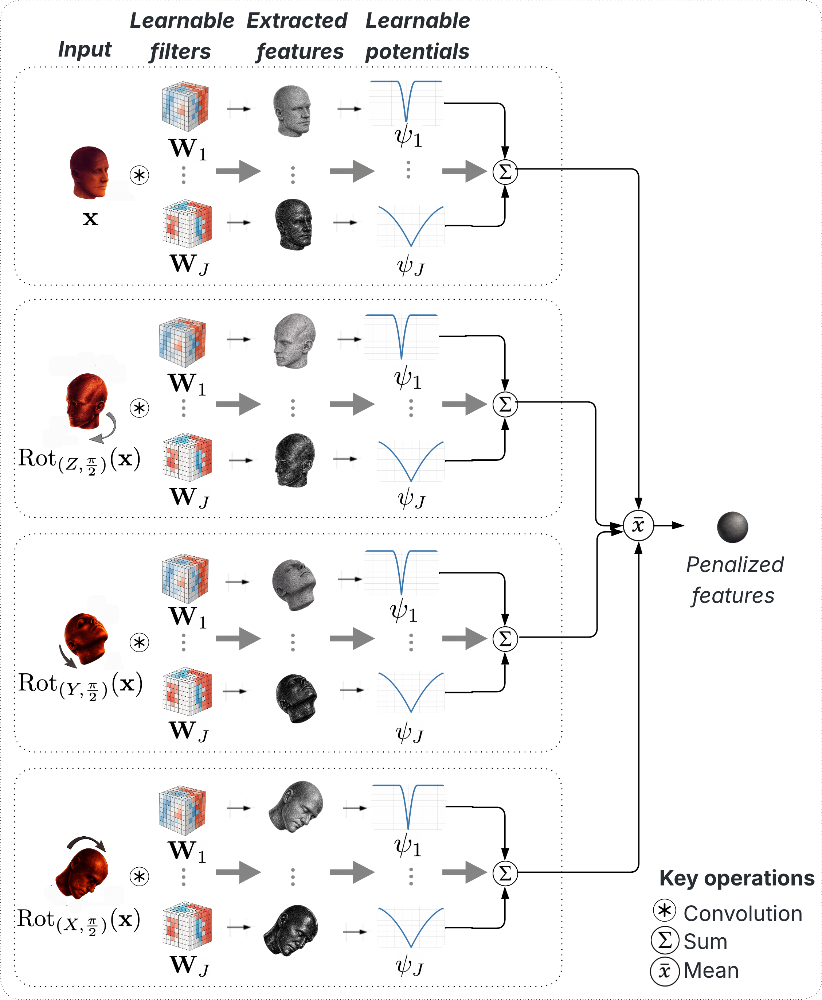
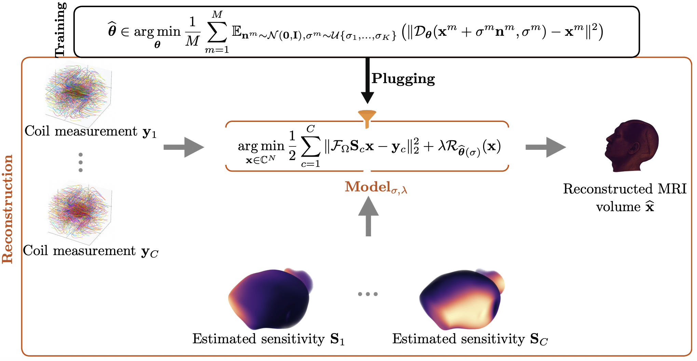

# Weakly Convex Ridge Regularization for 3D Non-Cartesian MRI Reconstruction

<table align="center">
  <tr>
    <td align="center">
      <br>
      <b>(a) Regularizer Architecture</b>
    </td>
    <td align="center">
      <br>
      <b>(b) Training and Reconstruction Pipeline</b>
    </td>
  </tr>
</table>

## 1. Installations & Preliminaries

To get started, clone the repository; And in the terminal you are going to run everything, set upstreamly:
```
export TF_ENABLE_ONEDNN_OPTS=0
export TF_CPP_MIN_LOG_LEVEL=3
```

### a. Installations
The code relies mainly on [DeepInverse](https://deepinv.github.io), [MRI-NUFFT](https://mind-inria.github.io/mri-nufft/) and [GGRAPPA](https://github.com/mind-inria/ggrappa). [Weights & Biases](https://docs.wandb.ai/models/quickstart#command-line) is used to monitor, visualize and save the results of the different runs. All the necessary dependencies can be installed by executing:

```
python -m pip install --upgrade pip
python -m pip install -r requirements.txt
python -m pip check
```
Note that at least a CUDA 12 machine is necessary. Previous versions might encounter some issues.

### b. Preliminaries
Before runing anything, sign up to Weights & Biases (If you don't have an account yet) through [wandb.ai/authorize](http://wandb.ai/signup). Once logged in into your account, go to *Settings → API keys*, then copy your **wandb API Key**. Finally in your Terminal (environment in which you are going to run everything), run ```wandb login```. You will be asked to provide your API Key; Paste it in there and validate. Your **wandb** automatic monitor of all the runs is all set.


## 2. Data Processing
The Calgary Campinas Train & Val data consist of 67 fully-sampled 12-coil k-space volumes saved as **.h5** files. First of all, organize them in a root directory that we will call **my_root_directory**, containing two folders named exactly **Train** (which contains the 47 .h5 training k-space volumes) and **Val** (which contains the 20 .h5 validation k-space volumes). For training purposes, we need the True image volumes (that we can compute by performing a 3D virtual coil combination (vcc) of the image domain versions of those kspaces). To get them, just run:
```
python data_processing/preprocess_calgary.py --root my_root_directory
```
It will create in each of the folders **Train** and **Val**, two sub-folders named **_images** (which contains the 12-coil image domain versions as .npy files; Each file actually keeps the name of its kspace version but ends with .h5.npy) and **_images_vcc** (which contains the estimated True MR image volumes via 3D virtual coil combination, as .npy files; Each file actually keeps the name of its kspace version but ends with .npy).


The Calgary Campinas Test data consist of 50 fully-sampled 12-coil k-space volumes and 50 fully-sampled 32-coil k-space volumes as **.h5** files. They just have to be organized as follows. In **my_root_directory**, create a folder named **Test** in which we have two sub-folders named **12coil** (which contains the  50 12-coil k-space .h5 files) and **32coil** (which contains the  50 32-coil k-space .h5 files). No further preprocessing of the Test data is required!


## 3. Baseline reconstruction methods & Trainings
We compare the *Weakly-Convex Ridge Regularizer (WCRR) + nmAPG (non-monotone Accelerated Proximal Gradient) solver* to the following baseline methods:
- GRAPPA
- Isotropic Total Variation (TV) regularizer + ADMM (Alternating Direction Method of Multipliers) solver
- $l_1$-wavelets regularizer + ADMM solver
- Plug-and-Play (PnP) DRUNet + ADMM solver
- (At the moment, only the above mentioned methods are implemented in this repository. We will add more baselines later on!)

Out of all of them, only WCRR (In its two versions) and DRUNet require training. We can train each of them by runing the following commands:
- For WCRR (rotation-invariant version): ```python training_wcrr.py --root my_root_directory```
- For WCRR (non-rotation-invariant version): ```python training_wcrr.py --root my_root_directory --regularizer_name "WCRR_no_rotations"```
- For DRUNet: ```python training_drunet.py --root my_root_directory``` (But not really necessary, as we can download the trained weights from hugging face!)


## 4. Hyperparameters tuning (This step can safely be skipped!)
Five specific validation volumes are chosen, and all the hyperparameters in each reconstruction method are tuned on them. *GRAPPA*'s parameters are already appropriately chosen and do not require tuning. We can tune the hyperparameters of each of the other methods by runing the following commands:
- For WCRR (rotation-invariant version): ```python hyperparameters_tuning/tune_wcrr.py --root my_root_directory```
- For WCRR (non-rotation-invariant version): ```python hyperparameters_tuning/tune_wcrr.py --root my_root_directory --regularizer_name "WCRR_no_rot"```
- For PnP-DRUNet: ```python hyperparameters_tuning/tune_pnp_drunet.py --root my_root_directory```
- For TV: ```python hyperparameters_tuning/tune_tv.py --root my_root_directory```
- For $l1$-wavelets: ```python hyperparameters_tuning/tune_l1_wavelets.py --root my_root_directory```

## 5. Reconstructions (This reproduces the results in the paper!)
The reconstructions with each method are performed on 30 testing volumes (among which the first 15 12-coil volumes and the first 15 32-coil volumes according to the alphabetical order of the volume file names) by running the following commands for coil = 12 and then for coil = 32:
- With WCRR (rotation-invariant version): ```python reconstructions.py --method "wcrr" --coil coil --root my_root_directory```
- With WCRR (non-rotation-invariant version): ```python reconstructions.py --method "wcrr_no_rot" --coil coil --root my_root_directory```
- With PnP-DRUNet: ```python reconstructions.py --method "drunet" --coil coil --root my_root_directory```
- With TV: ```python reconstructions.py --method "tv" --coil coil --root my_root_directory```
- With $l_1$-wavelets: ```python reconstructions.py --method "wv" --coil coil --root my_root_directory```
- GRAPPA reconstructions are automatically performed whenever one of the above reconstructions is launched, and the results are saved in wandb.

## 6. wandb routine to fetch the saved reconstruction results & visualize some reconstructions
The notebook **reconstruction_results.ipynb** contains the wandb routine to fetch the saved reconstruction metrics, and also the routine to visualize some saved reconstructions. And the notebook **reconstruction_examples.ipynb** shows how to reconstruct a single MRI volume with each method.
